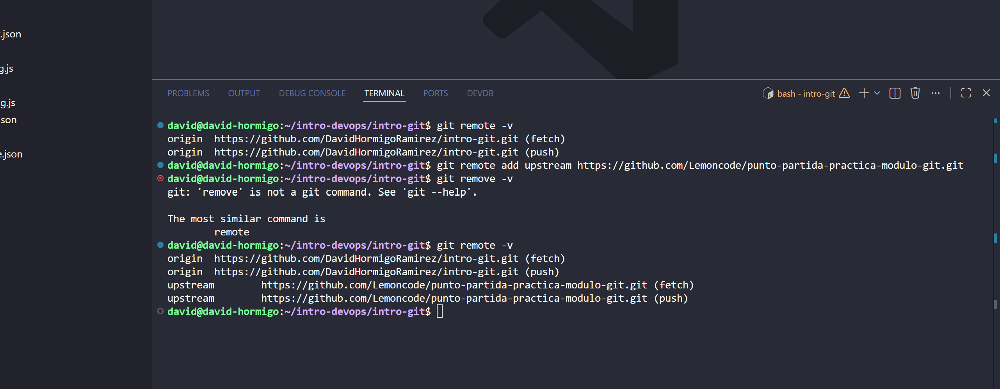
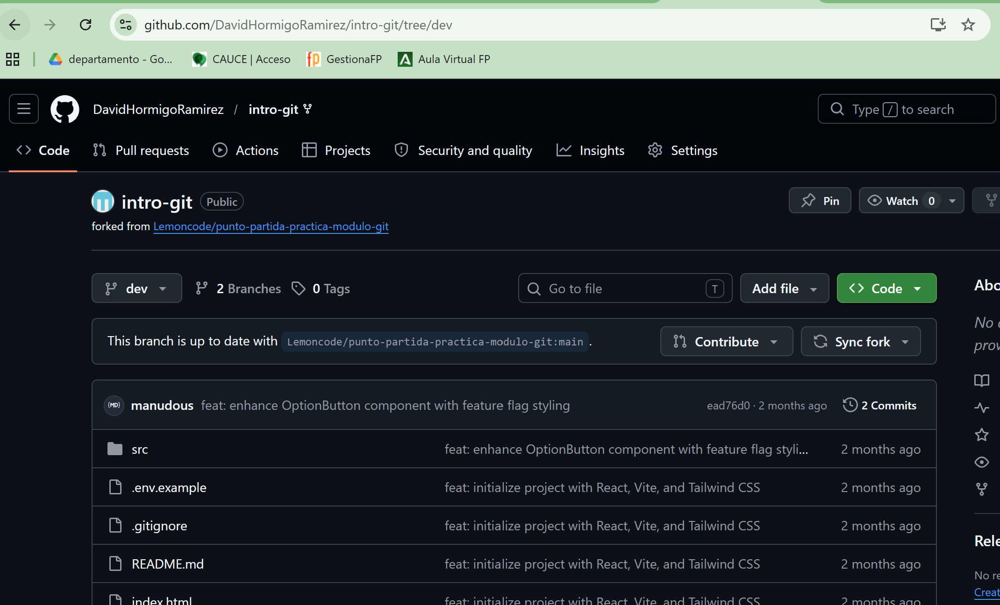
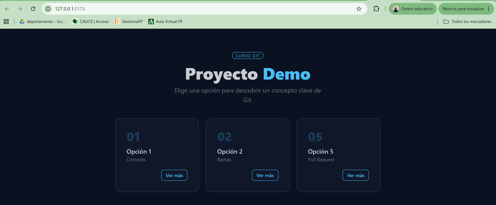
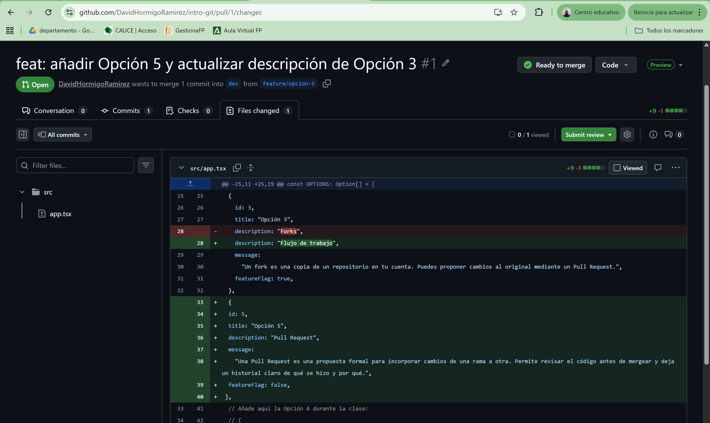
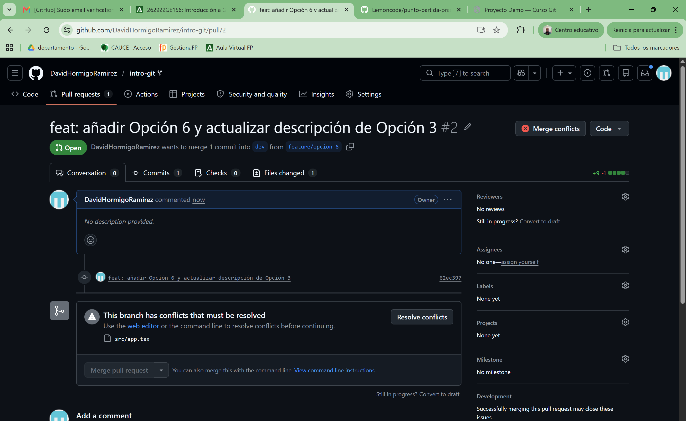
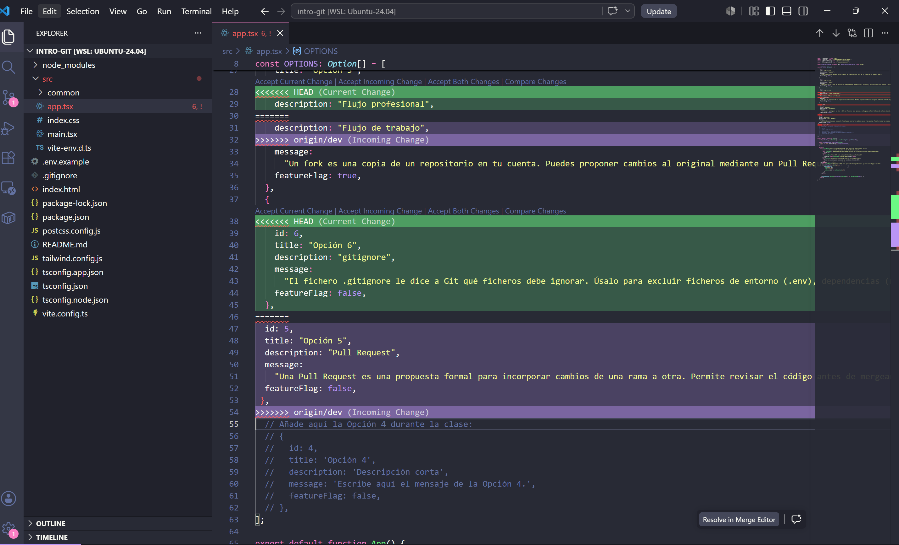
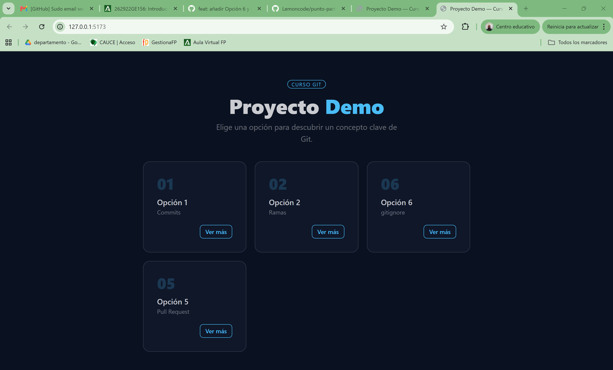
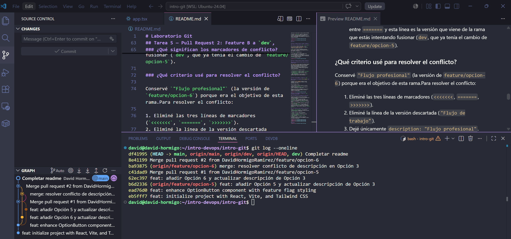

# Laboratorio Git
## Tarea 1 — Fork y configuración inicial

### ¿Qué es un fork y para qué sirve `upstream`?

Un **fork** es una copia completa de un repositorio ajeno que se aloja bajo tu propia cuenta de GitHub.

El remote **`upstream`** apunta al repositorio original. Tenerlo configurado nos permite traernos a tu fork los cambios que se publiquen en el futuro, manteniéndote sincronizado con la fuente de verdad del proyecto. 

---
## Tarea 2
---

## Tarea 2 — Feature branch A: añadir la Opción 5

### ¿Por qué la rama parte de `dev` y no de `main`?

En un flujo de trabajo profesional, **`main` representa el código en producción**. Nunca se trabaja directamente sobre ella.

**`dev`** es la rama de integración continua. Recibe todas las nuevas funcionalidades antes de que lleguen a producción.

Partir de `dev` garantiza que:

1. El trabajo nuevo se integra primero en el entorno de pruebas, no en producción.
2. Si otra persona ya ha fusionado otra feature en `dev`, tu rama parte con esos cambios incorporados, reduciendo futuros conflictos.
3. `main` permanece limpio.

---
## Tarea 3 — Feature branch B: añadir la Opción 6

### ¿Qué es un conflicto en Git y por qué se va a producir aquí?

Un **conflicto** ocurre cuando Git intenta fusionar dos ramas que han modificado la misma parte del mismo archivo de maneras distintas y no puede decidir automáticamente cuál versión es la correcta. Git para el merge y marca las zonas en disputa para que sea el desarrollador quien las resuelva manualmente.

El conflicto se va a producir por que:

- `feature/opcion-5` cambió el campo `description` de la Opción 3 a `"Flujo de trabajo"`.
- `feature/opcion-6` cambió ese mismo campo a `"Flujo profesional"`.
- Ambas ramas parten del mismo commit en `dev`, donde ese campo tenía un valor diferente.

---

## Tarea 4 — Pull Request 1: Feature A a `dev`

### ¿Qué revisé en la pestaña *Files changed* y por qué es útil?

La pestaña **Files changed** muestra el diff completo: líneas añadidas (en verde) y líneas eliminadas (en rojo).

Antes de mergear revisé:

- Que únicamente se habían tocado los archivos previstos (`src/app.tsx`).
- Que el cambio en `description` de la Opción 3 pasaba correctamente al nuevo valor.

Revisar el diff antes de mergear es una práctica fundamental porque permite detectar erroreso cambios no intencionados.

---
## Tarea 5 — Pull Request 2: Feature B a `dev`, resolución de conflicto

### ¿Qué significan los marcadores de conflicto?

Cuando Git no puede fusionar automáticamente, inserta marcadores en el archivo para delimitar las versiones en disputa:
- **`<<<<<<< HEAD`** — inicio del bloque conflictivo. Todo lo que está entre esta línea y `=======` es la versión de la rama en la que te encuentras actualmente (`feature/opcion-6` en este caso).
- **`=======`** — separador. Marca el límite entre las dos versiones.
- **`>>>>>>> origin/dev`** — fin del bloque. Todo lo que está entre `=======` y esta línea es la versión que viene de la rama que estás intentando fusionar (`dev`, que ya tenía el cambio de `feature/opcion-5`).

### ¿Qué criterio usé para resolver el conflicto?

Conservé `"Flujo profesional"` (la versión de `feature/opcion-6`) porque era el objetivo de esta rama.Para resolver el conflicto:

1. Eliminé las tres líneas de marcadores (`<<<<<<<`, `=======`, `>>>>>>>`).
2. Eliminé la línea de la versión descartada (`"Flujo de trabajo"`).
3. Dejé únicamente `description: "Flujo profesional"`.
4. Guardé el archivo, arranqué la app para verificar que todo se veía correctamente y realicé el commit de resolución.

---
## Tarea 6
Se puede ver el historial de commits de la practica:

## Conclusión

Lo que me resulta más dificil de git es corregir errores cuando cambias código en una rama incorrecta o quieres limpiar los hisotiral de commits. Despues de esta practica la resolución de conflictos tiene mucho más sentido.